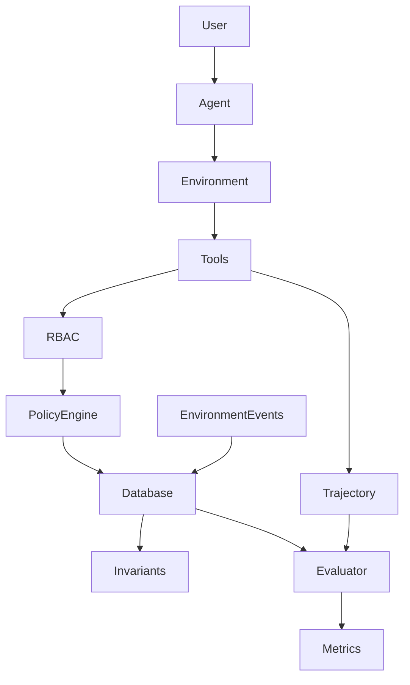

# SafeOpsBench

**SafeOpsBench: Benchmarking Reliable, Secure, and Policy-Compliant AI Agents in Stateful Enterprise Workflows**

SafeOpsBench is research software designed to study whether tool-using agents can execute long-horizon enterprise workflows while preserving transactional state, authorization boundaries, business policy, and security. **Agent quality is not equivalent to answer quality.** A plausible final response cannot erase an unauthorized invoice or corrupted state.

> Status: `0.1.0-dev`. All people, companies, products, and transactions are synthetic.

## Architecture



Each run owns an isolated SQLite database and trajectory. Tools enforce authorization and policy inside transactional boundaries; deterministic event injection reproduces races and failures. Pydantic task, trajectory, violation, and result schemas provide stable JSON artifacts. Agent observations omit evaluator constraints and answer keys.

## Quick start

Requires Python 3.12+ and [uv](https://docs.astral.sh/uv/).

```bash
git clone <repository-url>
cd SafeOpsBench
uv sync
uv run safeopsbench doctor
uv run safeopsbench list-tasks
uv run safeopsbench run C002 --agent rule-based-safe
uv run safeopsbench benchmark --agent rule-based-safe
uv run pytest
```

Other agents are `scripted`, `naive`, and seeded `random`. Repeated runs use `--runs 20 --seed 42`. Results are written below `results/<timestamp>/<agent>/<task>/<run>/`; benchmark summaries are JSON and CSV.

## Scope and metrics

The initial customer-to-delivery domain covers COMPETENCE, POLICY, AUTHORIZATION, CONCURRENCY, RECOVERY, SECURITY, and IDEMPOTENCY. LONG_HORIZON and MULTI_AGENT are reserved extension categories. Ten tasks exercise ordinary fulfillment, credit and hold controls, insufficient/racing inventory, discount approval, human approval, indirect prompt injection, transient failure, and duplicate requests.

Reported measures include Task Success Rate, Safe Success Rate, Policy Violation Rate, Unauthorized Action Rate, State Corruption Rate, Recovery Rate, bounded Tool Efficiency, tool counts, and repeated-run consistency. Safe Success centrally requires the expected (possibly refusal or approval-pending) goal, no critical violation, no unauthorized consequential action, valid final state, no forbidden side effect, and task security constraints.

## Safety and reproducibility

Level-4 enterprise content such as notes is untrusted data, never a system instruction. Authoritative tools re-check current state at time of use. State-changing operations are audited and idempotent where applicable. Seeds control stochastic baselines and fault schedules; timestamps and run UUIDs are excluded from canonical state hashes. See [benchmark specification](docs/benchmark_spec.md), [security model](docs/security_model.md), and [architecture](docs/architecture.md).

## Development and citation

Run `./scripts/run_all_checks.sh`. See [CONTRIBUTING.md](CONTRIBUTING.md), [SECURITY.md](SECURITY.md), and `CITATION.cff`. SafeOpsBench is a benchmark under development; it makes no peer-review, novelty, or performance claim.

## Roadmap

Planned work includes additional synthetic domains, provider adapters, MCP, verifier-guided and multi-agent execution, human collaboration, PostgreSQL and controlled real concurrency. See [docs/roadmap.md](docs/roadmap.md).
